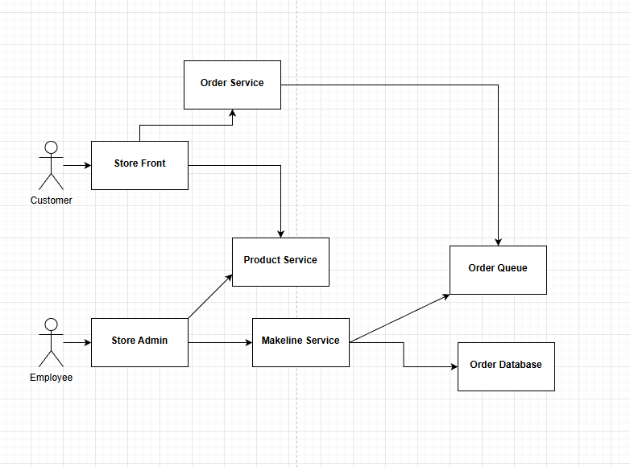

# Finalproject8915

## Brief Explanation
This application is built using a microservices architecture and runs entirely on AKS. Users access the system through two front-end applications: the store-front for customers and the store-admin for employees. Both front-ends are Vue.js applications. Inside the Kubernetes cluster, the front-end applications communicate with backend APIs using internal ClusterIP services. The product-service provides product data such as names, prices, descriptions, and image paths. The order-service is responsible for creating orders when a customer checks out.
When an order is submitted, the order-service stores the order in MongoDB, which runs as a StatefulSet with persistent storage to ensure data durability. At the same time, the order-service publishes an order message to RabbitMQ. RabbitMQ acts as a message broker between services. The makeline-service listens to the orders queue and consumes order messages asynchronously. Configuration data and credentials are injected into the containers using Kubernetes ConfigMaps and Secrets.

For deployment, each microservice has its own CI/CD pipeline implemented using GitHub Actions. When code is pushed to a repository, GitHub Actions builds a Docker image, pushes it to a container registry, and deploys the updated service to the AKS cluster using kubectl and a secure kubeconfig secret.

# Deployment Instructions

## 1. Prerequisites
- Azure subscription 
- Docker Hub account
- GitHub account

On your machine, you'll need:
- Azure CLI
- kubectl
- Access to docker hub
- Git

## 2. Clone the Repositories

- Clone the infrastructure repo (contains aps-all-in-one.yaml):

- Clone the microservice repos (each has its own CI/CD workflow):

## 3. Build and Push Docker Images 
From each service folder, build and push an image to Docker Hub.

Example for store-front:

docker build -t <dockerhub-username>/store-front:latest .

docker push domheallis/store-front-l9:latest

Repeat for the other services

Update aps-all-in-one-task2.yaml so each image: line points to the correct image

    image: docker.io/domheallis/store-front:latest

## 4. Create Resource Group and AKS Cluster
Log in and create a resource group:

    az login
az account set --subscription 

Create an AKS cluster with 2 nodes

## 5. Connect kubectl to the AKS Cluster
Get credentials and verify

az aks get-credentials \

kubectl get nodes

## 6. Deploy All Services Using aps-all-in-one.yaml

kubectl apply -f ./aps-all-in-one-task2.yaml

## 7. Configure GitHub Actions (CI/CD)
For each service repo (store-front, store-admin, product-service, order-service, makeline-service):

7.1. Add Repository Secrets

In GitHub:

Settings → Secrets and variables → Actions → New repository secret

Add:

DOCKER_USERNAME = dockerhub-username

DOCKER_PASSWORD = Docker Hub access token

KUBE_CONFIG_DATA = base64-encoded kubeconfig

## 7.2. Add Repository Variables
Settings → Secrets and variables → Actions → Variables

Example

store-front repo:

DOCKER_IMAGE_NAME = store-front

DEPLOYMENT_NAME = store-front

CONTAINER_NAME = store-front
Do this for all repos

Make sure each repo has a workflow file at:

.github/workflows/ci_cd.yaml
Get external IP from azure AKS Services and ingresses

# Links to all repos and docker hub image link

Store front (ignore l8 part, i didnt rename it)
- https://github.com/DomHeallis/store-front-L8
- https://hub.docker.com/r/domheallis/store-front-l9

product service
- https://github.com/DomHeallis/product-service-L8
- https://hub.docker.com/r/domheallis/product-service-l9

store admin
- https://github.com/DomHeallis/store-admin-L8
- https://hub.docker.com/r/domheallis/store-admin-l9

order service
- https://github.com/DomHeallis/order-service-L8
- https://hub.docker.com/r/domheallis/order-service-l9

makelin service
- https://github.com/DomHeallis/makeline-service-L8
- https://hub.docker.com/r/domheallis/makeline-service-l9

## YouTube

Youtube link:
- https://youtu.be/VwnV6Kb3GBs